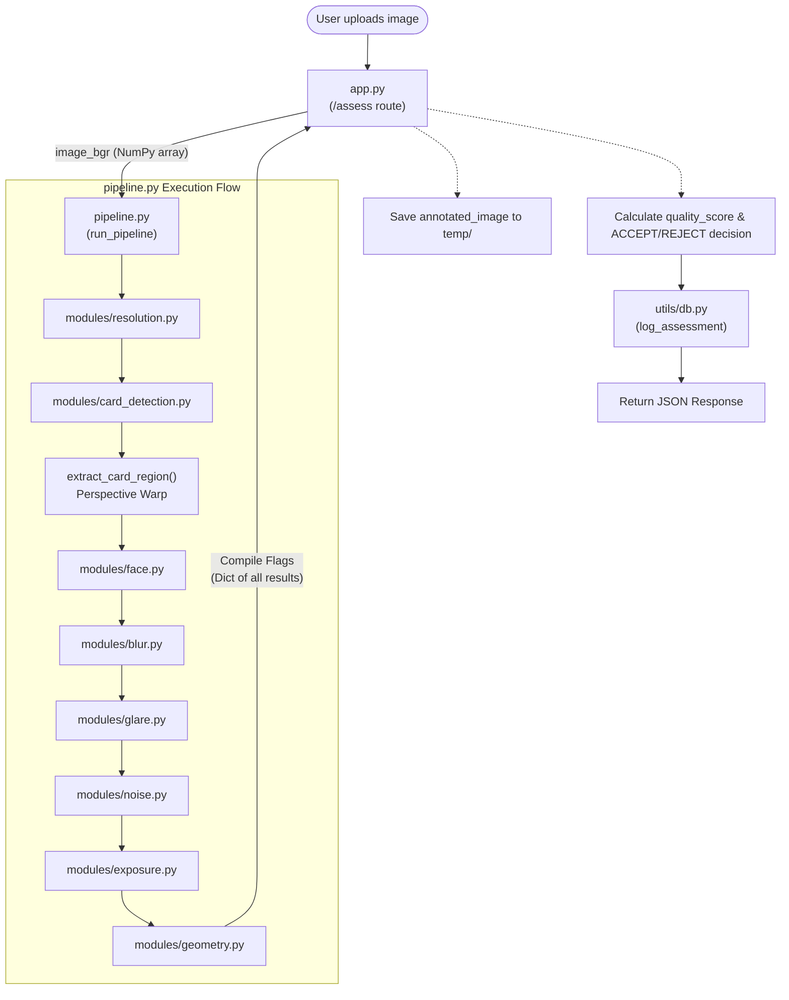

# ID Card QA Pipeline Data Flow

This document outlines the data flow of the ID Card Quality Assessment system, detailing how an uploaded image is processed through various modules and how the results are accumulated.

## Pipeline Architecture

The core processing logic orchestrates multiple checks in sequence. The overall flow can be summarized as follows:



## Step-by-Step Data Flow

### 1. Image Upload (`app.py`)
- **Endpoint**: `POST /assess`
- **Action**: Receives the uploaded image file.
- **Decoding**: The image is read into a byte buffer and then decoded using OpenCV (`cv2.imdecode`) into a BGR NumPy array (`image_bgr`).

### 2. Orchestration (`pipeline.py`)
The `image_bgr` array is passed to the `run_pipeline(image_bgr)` function in `pipeline.py`. This function coordinates the sequential execution of various specialized modules:

- **Resolution Check** (`modules/resolution.py`): Quick initial check to ensure the image meets minimum resolution requirements.
- **Card Detection** (`modules/card_detection.py`): Identifies the ID card within the image and extracts its boundary quadrilateral (`card_quad`).
- **Region Extraction**: If a card is detected, `pipeline.py` uses perspective warping (`cv2.warpPerspective`) to flatten the card into a normalized grayscale rectangle (`gray_card`).
- **Face Detection** (`modules/face.py`): Operates on the flattened `gray_card` to locate the user's face. The bounding box is then mapped back to the coordinates of the original unwarped image.
- **Blur/Focus Analysis** (`modules/blur.py`): Analyzes the sharpness of the full image, the card zone, and the face zone (using `card_quad` and `face_bbox`).
- **Glare Analysis** (`modules/glare.py`): Detects harsh reflections, focusing specifically on the card and face regions.
- **Noise Analysis** (`modules/noise.py`): Analyzes the graininess/noise levels across multiple regions.
- **Exposure Analysis** (`modules/exposure.py`): Checks for over/under-exposed areas.
- **Geometry Analysis** (`modules/geometry.py`): Verifies the aspect ratio and rotation using the `card_quad`.

### 3. Result Accumulation
Inside `pipeline.py`, the results from each module (which are typically Python dictionaries) are gathered into a single comprehensive dictionary:

```python
{
    "resolution": res_result,
    "card_detection": card_result,
    "face": face_result,
    "blur": blur_result,
    "glare": glare_result,
    "noise": noise_result,
    "exposure": exposure_result,
    "geometry": geometry_result,
    "annotated_image": annotated_image_numpy_array
}
```

### 4. Final Processing & Decision (`app.py`)
Once `pipeline.py` returns the combined results dictionary back to `app.py`:

- **Image Saving**: The `annotated_image` is written to the `temp/` folder with an automatically generated UUID string for the filename.
- **Decision Logic**: A final `ACCEPT` or `REJECT` decision is computed by checking if all critical attributes cross the required threshold to pass.
- **Scoring**: An overall `quality_score` (0-100) is calculated based heavily on the blur composite score with penalties applied for glare percentage.
- **Database Logging**: The full assessment data (`decision`, `scores`, boolean pass/fail flags per attribute) is inserted into a SQLite database via `utils/db.py` (`log_assessment`).
- **Response**: The final data, minus the heavy image matrix, is packaged into JSON representation along with the assessment ID and temporary image URL, and returned to the frontend.
